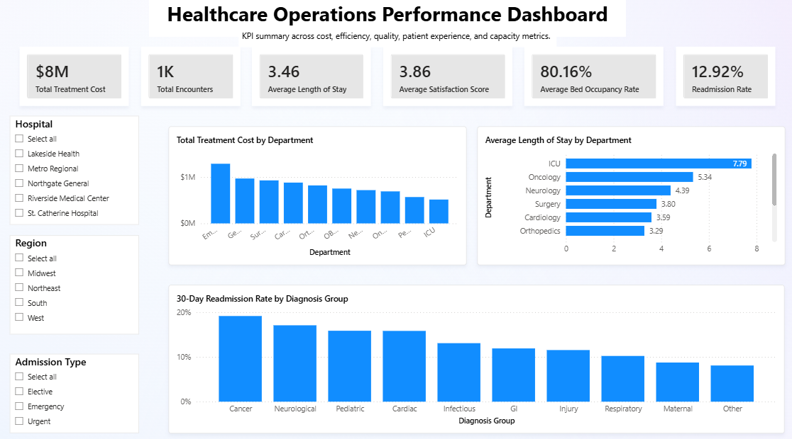

# 🏥 Healthcare Operations Analytics

## Dashboard Preview

End-to-end healthcare analytics project using Excel, SQL, and Power BI to evaluate operational efficiency, financial performance, quality outcomes, and patient experience KPIs.

---

## 📌 Project Overview

This project analyzes hospital encounter-level healthcare data to simulate a real-world healthcare operations reporting workflow.

The objective was to transform raw operational data into structured insights through:

- **Excel** for exploratory data analysis and KPI validation  
- **SQL** for backend aggregation and segmentation analysis  
- **Power BI** for interactive executive dashboard visualization  

The project demonstrates a full data analysis lifecycle. From raw data to business-ready reporting.

---

## 🛠 Tools & Technologies

- Microsoft Excel  
- SQL  
- Power BI Desktop  
- DAX (Data Analysis Expressions)

---

## 📊 Excel Analysis

Excel was used to perform structured exploratory analysis and validate key performance indicators prior to dashboard development.

### Executive KPIs Calculated:
- Total Treatment Cost  
- Total Encounters  
- Average Length of Stay (Days)  
- 30-Day Readmission Rate  
- Average Patient Satisfaction Score  
- Average Bed Occupancy Rate  

### Pivot Analysis Included:
- Treatment cost by department  
- Length of stay by department and admission type  
- Readmission rate by diagnosis group  
- Satisfaction score by department and hospital  
- Bed occupancy by hospital and department  

### Skills Demonstrated:
- Pivot tables and aggregation logic  
- Derived metric calculation (Cost per Day)  
- KPI formatting and executive-style reporting  
- Business-focused data interpretation  

---

## 🗄 SQL Analysis

SQL was used to replicate KPI calculations and perform deeper segmentation and trend analysis.

### Query Topics Included:
- Executive KPI aggregation (SUM, COUNT, AVG)  
- Cost analysis by department and hospital  
- Length of stay by department and admission type  
- Readmission rate segmentation  
- Patient satisfaction analysis  
- Capacity utilization analysis  
- Monthly performance trends  
- Outlier identification (high-cost encounters)  

### Skills Demonstrated:
- GROUP BY and aggregation logic  
- ORDER BY ranking  
- HAVING filters for segmentation  
- Derived metric calculations using NULLIF  
- KPI consistency across tools  

---

## 📈 Power BI Dashboard

An interactive executive dashboard was developed to visualize healthcare performance metrics dynamically.

### Dashboard Features:
- KPI summary cards  
- Cost analysis by department  
- Average Length of Stay comparison  
- 30-Day Readmission Rate by diagnosis group  
- Interactive slicers (Hospital, Region, Admission Type)  

### DAX Measures Created:
- Total Treatment Cost  
- Total Encounters  
- Average Length of Stay  
- Readmission Rate  
- Average Patient Satisfaction Score  
- Average Bed Occupancy Rate  

### Skills Demonstrated:
- DAX measure development  
- Data modeling fundamentals  
- Executive dashboard layout design  
- KPI-driven storytelling  
- Interactive filtering  

---

## 📌 Key Insights

- ICU and Oncology departments demonstrated higher average Length of Stay compared to other departments.
- Treatment costs vary significantly across departments.
- Readmission rates differ by diagnosis group, highlighting potential quality improvement areas.
- Patient satisfaction remains relatively stable but varies slightly by department.

---

## 🎯 Project Objective

This project was developed to demonstrate entry-level data analyst skills aligned with business intelligence and operations reporting roles.

## Project Workflow

1. Performed exploratory analysis and KPI validation in Excel using pivot tables.
2. Wrote SQL queries to calculate operational and financial metrics.
3. Imported cleaned data into Power BI.
4. Created DAX measures for key healthcare KPIs.
5. Designed an interactive dashboard to visualize cost, efficiency, quality, and patient experience metrics.
